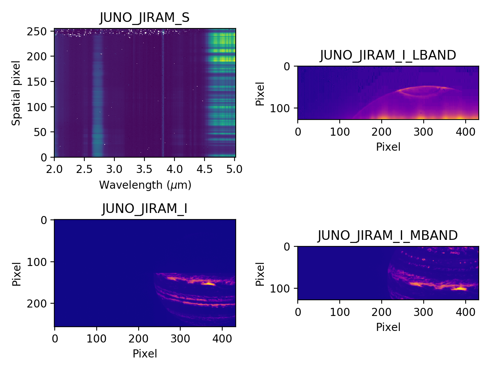

# Juno JIRAM preview files

## JIRAM Data Products

* `JUNO_JIRAM_S` - spectrograph spectral image
* `JUNO_JIRAM_I` - the full imaging detector which has a M band part and a L band part
* `JUNO_JIRAM_I_MBAND` - only the M band portion of the imager
* `JUNO_JIRAM_I_LBAND` - only the L band portion of the imager

 

